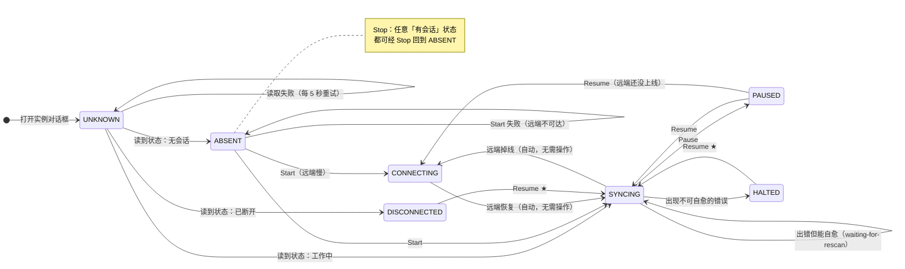

# Mutagen GUI 需求文档（v1）

> **状态**：草案 v0.4  
> **目的**：明确 MutagenGUI 第一版要做什么、不做什么  
> **阅读对象**：作者本人 / 潜在协作者  
> **v0.2 变更**：交互模型对齐 SSHFS-Win Manager（Add Connection / Edit mode / Delete mode）；明确「一切操作围绕 yml 文件」  
> **v0.3 变更**：ADVANCED 标签页支持全部 yml 参数 + 多值参数动态增行；新增**附录 C（基于 Mutagen 0.18.1 实测的字段白名单）**  
> **v0.4 变更**：新增 **6.6 UI 设计规范**（配色对标 SSHFS-Win Manager）、**6.7 空状态**、**F8~F12**；补充 conda 开发环境；新增**附录 D 复查记录**  
> **v0.5 变更**：两项决策定稿 —— **连接区采用 SSH 别名优先**（6.3）、**一个 yml 只支持一个同步会话（方案 A）**（附录 D.2）  
> **v0.6 变更**：新增 **3.6 会话状态机**（状态定义 / status 映射 / Mermaid 转移图 / 转移表 / 按钮矩阵 / 实现约定）；F2 的按钮规则收敛为对 3.6 的引用；修正「有 `lastError` 就显示已停止」的标签错误  
> **v0.7 变更**：新增 **残留锁文件**（`<yml>.lock`）的识别与两道防线 —— 实测确认**同步运行时关机/重启**就会触发，导致 `project start` 永久报 `already running`；F11.7/F11.8 加入状态残留标记与徽章优先级；7.4 加入「终止一律走 `project terminate`」铁律

---

## 1. 项目概述

| 项 | 说明 |
|---|---|
| **项目名** | MutagenGUI |
| **一句话描述** | 一款 Windows 桌面 GUI 工具，用类似 SSHFS-Win Manager 的交互来管理多个 Mutagen 同步项目 |
| **核心目标** | 把「每个 yml 文件 = 一个独立、持久的同步实例」做成产品级体验 |
| **首要用户** | 工具的作者本人（开发者），其次是同样用 Mutagen 做远程开发的同行 |

---

## 2. 背景与动机

### 2.1 现行工作流的痛点

- 每次都要 `cd D:\code` 才能跑 `mutagen project ...`，因为配置文件在工作目录里
- 不知道哪些项目现在处于「运行中 / 已暂停 / 连接失败」状态，要靠记忆
- 想看某个项目的实时同步事件，必须切到对应目录执行 `mutagen sync monitor <name>`
- 多个项目的 ignore 规则大同小异，每次新建都要复制粘贴一大段
- yml 文件改完容易忘 `mutagen project terminate/start` 让它生效
- 切有卡/无卡模式后 SSH 端口可能变，要改 `~/.ssh/config`，GUI 可以做这个提示

### 2.2 现有方案对比

| 方案 | 缺点 |
|---|---|
| Mutagen 官方 CLI + 项目文件 | 命令行心智负担大，状态不可视 |
| `osteele/mutagui`（TUI） | 终端界面，不支持图形化新建 / 编辑 yml |
| Docker Desktop Mutagen 扩展 | 仅服务于容器场景 |

### 2.3 设计参考：SSHFS-Win Manager

本工具的交互模型**直接对标 SSHFS-Win Manager**：

- **主界面**：左侧实例列表 + 右侧竖排操作按钮（Add Connection / Edit mode / Delete mode / Settings / About）
- **Add Connection**：一个表单对话框（BASIC / ADVANCED 两个标签页）→ Save 落盘
- **Edit mode / Delete mode**：全局"模式"，隔离危险操作，避免误点

**关键差异**：SSHFS-Win Manager 的配置存进自己的配置库；本工具的**唯一事实来源是磁盘上的 yml 文件**。

---

## 3. 核心概念

### 3.1 实例（Instance）

**一个实例 = 一个 yml 文件 = 一个 Mutagen 同步项目。**

- 实例有唯一的本地 ID（UUID）和用户起的名字（如 `OnePoseviaGen`）
- 实例有当前状态：`Running` / `Paused` / `Disconnected` / `Error` / `Not Started`
- 实例绑定一个 yml 文件路径，alpha / beta 等元数据全部**从 yml 内容派生**

### 3.2 ⭐ 核心原则：一切围绕 yml 文件

**yml 文件是唯一的事实来源**，GUI 只是它的图形化读写器：

| 用户动作 | 本质上对 yml 做了什么 |
|---|---|
| Add Connection | **生成**一个新 yml 文件 |
| Edit mode | **修改**一个已存在的 yml 文件 |
| Delete mode | **删除**一个 yml 文件 |
| Start / Stop / Pause / ... | 对 yml 里定义的会话**执行** Mutagen 命令 |
| 点击实例查看状态 | **读取** yml 内容 + 查询运行态 |

由此推出两条硬性要求：

1. **互操作性**：GUI 生成的 yml 与手写 yml 格式完全一致，脱离 GUI 也能用命令行跑
2. **可观测性**：GUI 外部手改 yml，重启 GUI 后能自动读到新内容

### 3.3 持久化模型

- **GUI 关闭 ≠ Mutagen 会话结束**：Mutagen daemon 在后台独立运行，GUI 只是它的「查看器 + 控制面板」
- **GUI 重开 = 重新枚举所有实例**：从注册表读出实例列表，逐个查 Mutagen 状态 → 显示在列表上
- **注册表只存"yml 在哪"**：因为 yml 才是事实来源，注册表本质是个「最近打开的 yml 列表」

### 3.4 三种应用模式

主界面右侧有三个按钮，其中后两个是**互斥的操作模式**：

| 模式 | 进入方式 | 点击实例行的行为 | 退出方式 |
|---|---|---|---|
| **普通模式**（默认） | 程序启动即处于此模式 | 弹出**实例操作对话框**（Mutagen 命令按钮） | 无需退出 |
| **编辑模式**（Edit mode） | 点 "Edit mode" 按钮 | 弹出 **yml 编辑对话框**（预填当前值），Save 覆盖原 yml | 再点一次 / 按 `Esc` |
| **删除模式**（Delete mode） | 点 "Delete mode" 按钮 | 弹出**删除确认**，确认后删除 yml + 注册表条目 | 再点一次 / 按 `Esc` |

**设计理由**：Edit / Delete 都是危险操作，用模式隔离避免误点。普通模式下点实例永远只是「打开操作面板」，绝不改动任何文件。

**Delete mode 的边界（重要）**：

- 删除的是**磁盘上的 yml 文件**和**注册表条目**
- **不会**动 alpha 目录里的代码
- **不会**删除 beta（远程）上的任何内容
- Mutagen 会话由 daemon 独立维护，删 yml 不会让它消失 → 确认框里提供默认勾选的选项：「**同时终止对应的 Mutagen 会话**」

### 3.5 yml 编辑器（查看 / 编辑）

| 模式 | 用途 | 何时进入 |
|---|---|---|
| **查看（只读）** | 语法高亮浏览，不可改 | 操作对话框里点「查看 yml」 |
| **编辑** | 可修改 alpha / beta / ignore 等 | Edit mode 点实例，或操作对话框里点「编辑 yml」 |

进入编辑模式后显示明确的「修改未保存」提示（橙色圆点 / 状态栏文字）。

**保存行为**：

- yml 写入磁盘
- 若实例当前 `Running`：弹窗提示「配置变更需重启会话才生效」，可选 **立即重启 / 仅保存（稍后手动重启）/ 取消**
- 若实例未运行：保存即生效，下次启动按新配置
- YAML 语法校验失败：阻止保存，定位到错误行

**撤销/重做**：v1 不实现，v2+ 考虑。

---

### 3.6 会话状态机（⭐ 本 GUI 最容易出错的地方）

> **为什么要单独建模**：界面上「哪些按钮能点」**只由会话处于什么状态决定**。
> 但 Mutagen 有十几个原始 `status` 取值，它们不是为界面设计的——
> 例如 `waiting-for-rescan`（出错但**在自动重试**）与 `halted-on-error`（**真的停了**）
> 都带 `lastError`，可一个完全不用管、一个必须人工介入。
>
> 所以先归并成**行为上可区分**的少数状态，再让按钮策略只依赖这少数状态。
> 定义是**唯一的**：代码在 `mutagen_core/states.py`，界面只查表。

#### 3.6.1 状态定义

| 状态 | 含义 | 会话存在？ | 需要人工？ |
|---|---|---|---|
| **`UNKNOWN`** 未知 | 还没读到会话状态——**不知道**会话存不存在 | 未知 | — |
| **`ABSENT`** 无会话 | 读到了：会话不存在（未启动）| 否 | — |
| **`CONNECTING`** 连接中 | 会话存在，正在连接某一端 | 是 | **不需要**（daemon 自动重连）|
| **`SYNCING`** 工作中 | 正常同步 / 扫描 / 暂存 / 切换状态 | 是 | 不需要 |
| **`PAUSED`** 已暂停 | 用户主动暂停 | 是 | 不需要（点 Resume）|
| **`HALTED`** 出错停止 | 出错**已停止**，不会自愈 | 是 | **需要**（点 Resume）|
| **`DISCONNECTED`** 已断开 | `status == "disconnected"`，不在自动重试 | 是 | 视情况 |

> ⚠️ **`UNKNOWN` 与 `ABSENT` 必须分开**。把「未知」当成「没有会话」，
> `Start` 就成了唯一可点项，用户一点就报 `project already running`——**实测踩过**。

#### 3.6.2 原始 `status` 到状态的映射

| Mutagen 原始 `status` | 归入状态 | 说明 |
|---|---|---|
| （状态读取失败 / 尚未读到）| `UNKNOWN` | |
| （`sync list` 里没有这个会话）| `ABSENT` | |
| `connecting-alpha` / `connecting-beta` | `CONNECTING` | 首次连接与掉线重连**行为相同**，不必区分 |
| `watching` / `scanning` / `reconciling` | `SYNCING` | |
| `staging-alpha` / `staging-beta` | `SYNCING` | |
| `transitioning` / `saving` | `SYNCING` | |
| **`waiting-for-rescan`** | **`SYNCING`** | ⭐ 有错**但在自动重试**（每 5 秒重扫），**不是**已停止 |
| `paused`（或 `paused: true`）| `PAUSED` | |
| `halted-on-error` | `HALTED` | |
| `disconnected` | `DISCONNECTED` | |

#### 3.6.3 状态转移图



> ★ = 尚未实测确认（见 3.6.6）

#### 3.6.4 状态转移表

| # | 起点 | 事件 | 终点 | 谁触发 | 需人工？ |
|---|---|---|---|---|---|
| 1 | — | 打开实例对话框 | `UNKNOWN` | 界面 | — |
| 2 | `UNKNOWN` | 读到状态：有会话且工作中 | `SYNCING` | 界面轮询 | 否 |
| 3 | `UNKNOWN` | 读到状态：无会话 | `ABSENT` | 界面轮询 | 否 |
| 4 | `UNKNOWN` | 读取失败 | `UNKNOWN`（显示「读取状态失败」）| 界面轮询 | 否（自动重试）|
| 5 | `ABSENT` | **Start 成功**（远端慢 / 已就绪）| `CONNECTING` / `SYNCING` | 用户 | — |
| 6 | `ABSENT` | Start 失败（远端不可达）| `ABSENT` | 用户 | 需远端开机 |
| 7 | `ABSENT` | Start 失败（`already running`）| 强制重读 → 真实状态 | 用户 | 否（状态读取滞后）|
| 8 | `CONNECTING` | 远端恢复 | `SYNCING` | **daemon 自动** | **否** |
| 9 | `SYNCING` | 远端掉线 | `CONNECTING` | **daemon 自动** | **否** |
| 10 | `SYNCING` | Pause | `PAUSED` | 用户 | — |
| 11 | `PAUSED` | Resume（远端已通 / 未通）| `SYNCING` / `CONNECTING` | 用户 | — |
| 12 | `SYNCING` | 可自愈的错误 | `SYNCING`（`waiting-for-rescan`）| **daemon 自动** | **否** |
| 13 | `SYNCING` | 不可自愈的错误 | `HALTED` | daemon | **是** |
| 14 | `HALTED` | Resume | `SYNCING` / `CONNECTING` ★ | 用户 | — |
| 15 | `DISCONNECTED` | Resume | `SYNCING` / `CONNECTING` ★ | 用户 | — |
| 16 | 任意有会话 | Stop | `ABSENT` | 用户 | — |
| 17 | 任意有会话 | Restart | `ABSENT` → 重建 → `SYNCING` | 用户 | — |

> ⭐ **#8 与 #9 是本设计的核心价值**：远端掉线 / 恢复完全由 Mutagen daemon 自动处理，
> **用户什么都不用做**。界面文案必须明确说清，否则用户会以为要去点 Resume。

#### 3.6.5 按钮可用性矩阵（状态机的直接产物）

| 状态 | Start | Stop | Restart | Monitor | Pause | Resume | Flush | List |
|---|---|---|---|---|---|---|---|---|
| `UNKNOWN` 未知 | ✗ | ✗ | ✗ | ✗ | ✗ | ✗ | ✗ | ✓ |
| `ABSENT` 无会话 | ✓ | ✗ | ✗ | ✗ | ✗ | ✗ | ✗ | ✓ |
| `CONNECTING` 连接中 | ✗ | ✓ | ✓ | ✓ | ✓ | ✗ | ✗ | ✓ |
| `SYNCING` 工作中 | ✗ | ✓ | ✓ | ✓ | ✓ | ✗ | ✓ | ✓ |
| `PAUSED` 已暂停 | ✗ | ✓ | ✓ | ✓ | ✗ | ✓ | ✗ | ✓ |
| `HALTED` 出错停止 | ✗ | ✓ | ✓ | ✓ | ✗ | **✓** | ✗ | ✓ |
| `DISCONNECTED` 已断开 | ✗ | ✓ | ✓ | ✓ | ✗ | ✓ | ✗ | ✓ |

**判据只有三类**：

1. **会话是否存在** —— `Start` 只在不存在时可用；`Stop` / `Restart` / `Monitor` 只在存在时可用
2. **当下做有没有意义** —— `Flush`（连接中「刷新」无意义）；`Pause` / `Resume`
3. **永远可点** —— `List`（只读诊断，出任何问题都能用它看现场）

> **三条最容易搞错的**：
>
> - `CONNECTING` 时 `Start` **必须灰着**——会话没消失，再点只会报 `already running`
> - `HALTED` 时 `Pause` 无意义（已经停了），出口是 `Resume`
> - `UNKNOWN` 时只留 `List`——**绝不把「不知道」当成「可以 Start」**

#### 3.6.6 实测发现的两个标签错误（已修）

| 问题 | 实测结论 | 处置 |
|---|---|---|
| 只要有 `lastError` 就显示「**出错已停止**」 | 实测 `maxEntryCount` 超限时 `status = waiting-for-rescan`、`lastError` 有值、`paused = false`，人类可读输出为 `Status: Waiting 5 seconds for rescan`——**Mutagen 每 5 秒自己重扫，根本没停** | 拆成两个标签：「出错，自动重试中…」（警告色）与「出错已停止」（危险色）|
| `STATUS_LABELS` 缺 `waiting-for-rescan` / `saving` | 未映射的状态会直接显示英文原文 | 已补 |

★ **仍需实测确认的一项**：`HALTED` 的出口。用 `maxEntryCount` 超限**无法**触发
`halted-on-error`（只会进 `waiting-for-rescan`），所以「点 `Resume` 能让 halted 会话复活」
目前是按 Mutagen 语义推断的，尚未实测。代码已按此实现，首次真实遇到时需复核。

#### 3.6.7 实现约定

| 事项 | 约定 |
|---|---|
| 定义位置 | `mutagen_core/states.py`：`GuiState` / `classify()` / `OPERATIONS` |
| 按钮策略 | **只有一张表**：`OPERATIONS[状态] -> 可点的按钮集合` |
| 界面职责 | `op_dialog._update_header()` **按表统一赋值**，不逐个按钮写 `if` |
| 防漂移 | 断言：界面按钮集合必须等于 `ALL_OPERATIONS` |
| 测试 | `selftest` 覆盖 `classify()` 与策略表完备性；`app.py --check` 覆盖 **7 状态 × 8 按钮**全矩阵 |

> ⚠️ **为什么强调「按表统一赋值」**：以前是逐个 `setEnabled`，补
> 「状态未知时禁用全部按钮」时漏掉了重新启用 `Monitor` → 它**永久变灰**。
> 表驱动从结构上消灭了这类 bug——新增按钮时表里没有它，断言会立刻报错。

---

## 4. 功能需求

### F1. 实例（yml）管理

| 编号 | 描述 |
|---|---|
| F1.1 | **Add Connection（新增 yml）**：点按钮打开表单对话框，填写实例名 / Local 路径 / Remote 连接 / **yml 保存路径（可修改）** → Save 后生成 yml 文件并加入注册表 |
| F1.2 | **Edit mode（编辑 yml）**：进入模式后点实例行 → 打开预填的编辑对话框 → Save 覆盖写入原 yml |
| F1.3 | **Delete mode（删除 yml）**：进入模式后点实例行 → 删除确认（可勾选同时终止会话）→ 删除 yml 文件 + 注册表条目 |
| F1.4 | **点击实例（普通模式）**：弹出实例操作对话框，含全部 Mutagen 命令按钮（见 F2） |
| F1.5 | **导入已有 yml**：选择一个已存在的 yml 文件 → 解析 alpha / beta → 加入注册表（不新建文件） |
| F1.6 | **通过「选择文件夹」导入**：按匹配规则定位 yml：① 文件夹里有 `mutagen.yml` 或 `<foldername>.yml`；② 注册表里有 alpha 匹配的；③ 都没有 → 引导走 F1.1 新建 |
| F1.7 | **重命名实例**：只改注册表显示名，不改 yml 文件名（yml 是磁盘文件名，重命名有同步风险） |
| F1.8 | **复制 alpha 路径 / beta 端点 / yml 路径** 到剪贴板 |
| F1.9 | **多值参数动态增行**：`ignore.paths`、`commands`、生命周期钩子等列表型参数，均支持 `[+]` 新增行 / `[−]` 删除行 |
| F1.10 | **完整参数支持**：Add Connection 的 ADVANCED 标签页覆盖 yml 的全部主要字段（见 [附录 C]），不只是 alpha/beta |
| F1.11 | **保存前静态校验**：字段白名单 + 枚举取值 + 类型检查 + YAML 语法校验，保证生成的 yml 能被 Mutagen 严格解析 |
| F1.12 | **yml 丢失检测**：启动时与每次状态轮询都检查各实例的 yml 是否还存在；丢失的实例**整行置灰** + 红色「⚠ 文件丢失」徽章 + 显示期望路径；点击该行弹出处理选项：**移除条目 / 重新定位文件… / 取消** |

### F2. 实例操作（操作对话框里的按钮）

| 按钮 | 命令 | 状态前置 |
|---|---|---|
| Start | `mutagen project start -f <yml>` | **仅当会话不存在时可用**（会话已存在要改用 Resume，否则会报「已存在」）|
| Stop | `mutagen project terminate -f <yml>` | 会话存在时可用，**需二次确认** |
| Pause | `mutagen sync pause <session>` | 会话**未暂停且未停止**（`HALTED` 时无意义——已经停了）|
| Resume | `mutagen sync resume <session>` | 会话**已暂停或已停止**（`PAUSED` / `HALTED` / `DISCONNECTED` 的出口；连接中无需 Resume，daemon 自己在重试）|
| Flush | `mutagen sync flush <session>` | 会话存在且**实际在同步**（连接中不可用）|
| Restart | Stop + Start 组合 | 会话存在 |
| Monitor | `mutagen sync monitor <session>`（流式输出到日志面板） | 会话存在（要有个会话可盯）|
| List | `mutagen project list -f <yml>`（详情打到日志面板） | **任何状态都可点**（只读诊断）|
| 查看 yml | 只读打开 yml | — |
| 编辑 yml | 打开编辑器（等同 Edit mode 的效果） | — |
| 打开 yml 目录 | 资源管理器定位到 yml | — |

> ### ⭐ 按钮策略由状态机决定 —— 见 **3.6 会话状态机**
>
> 本节只列「按钮 ↔ 命令」的对应关系。**「什么状态下哪些按钮能点」的完整矩阵、
> 状态定义、转移图与实现约定全部在 3.6**，那里是唯一定义处
> （代码：`mutagen_core/states.py`）。
>
> 三句话概览：
>
> - `UNKNOWN`（状态还没读回来）只留 `List`
>   ——**绝不把「不知道」当成「可以 Start」**
> - **会话存在时 `Start` 一律灰着**（含掉线重连）
>   ——会话并没有消失，再点只会报 `already running`
> - `HALTED`（出错停止）时 `Pause` 无意义，出口是 `Resume`
>
> **兜底**：若 `Start` 仍返回 `already running`（说明状态读取确实滞后），
> 界面会显式解释原因，并强制重读状态刷新按钮。

### F3. yml 编辑器（双模式）

| 编号 | 描述 |
|---|---|
| F3.1 | 查看模式：只读高亮显示 yml；顶部显示状态、alpha/beta、会话 ID |
| F3.2 | 编辑模式：可编辑全部内容；语法高亮 + 自动缩进 |
| F3.3 | 保存：写磁盘 + 按 3.5 节规则处理重启提示 |
| F3.4 | 验证：保存前用 `yaml.safe_load` 校验，失败则阻止并定位错误行 |
| F3.5 | 撤销/重做：v1 不实现 |

### F4. 实例的两种来源

| 来源 | 行为 |
|---|---|
| **Add Connection 新建**（主要入口） | 填表 → Save → 生成全新 yml → 状态 `Not Started`，点实例 → Start 启动 |
| **导入已有 yml**（次要入口） | 选择现有 yml（或文件夹，按匹配规则找）→ 解析 alpha/beta → 加入注册表 → 状态由 `mutagen sync list` 决定 |

> 匹配规则（用于「选文件夹」）：① 文件夹里有 `mutagen.yml` 或 `<foldername>.yml`；② 注册表里有 alpha 匹配的；③ 都没有 → 引导走 Add Connection 新建。

### F5. 状态监控与日志

| 编号 | 描述 |
|---|---|
| F5.1 | 实例列表每行显示状态徽章（● Running / ○ Stopped / ⚠ Disconnected / ✕ Error） |
| F5.2 | 操作对话框内嵌日志面板：命令输出 + 实时同步事件流（来自 monitor） |
| F5.3 | 全局通知：实例状态变化（如 Running → Disconnected）时弹出 Windows toast |
| F5.4 | 状态轮询：GUI 在前台时每 5 秒调一次 `mutagen sync list --template '{{json .}}'` 刷新 |
| F5.5 | 冲突高亮：Conflicts > 0 时列表行变红 + 操作对话框显示冲突文件列表 |

### F6. 持久化

程序数据统一放在**项目目录下的 `.config`**（便携式布局，整个程序目录可整体拷贝走）。

| 数据 | 存储位置 | 格式 |
|---|---|---|
| 实例列表（最近打开的 yml） | `.config/projects.json` | JSON |
| Mutagen 路径 / 默认 yml 保存目录 / 默认 SSH 别名 / 轮询间隔 | `.config/settings.json` | JSON |
| 单实例锁 | `.config/app.lock` | 含进程 PID 的文本 |
| 新建实例的 yml 默认目录 | `./ymls/` | YAML |
| 日志历史 | 不持久化（重启清空） | — |

> - 环境变量 `MUTAGENGUI_CONFIG_DIR` 可覆盖配置目录
> - 早期版本把数据放在 `%APPDATA%\MutagenGUI`；首次启动会自动迁移
>   （**复制**而非移动，旧文件保留原地作为备份）
> - 注册表**只记「yml 在哪」**，配置本身始终在 yml 文件里（见 3.2）

### F7. 设置

- Mutagen 可执行文件路径
- 默认 yml 保存目录
- 默认 SSH 别名
- 状态轮询间隔（默认 5 秒）
- 主题（v1 仅亮/暗二选一）

### F8. 环境检测与引导

| 编号 | 描述 |
|---|---|
| F8.1 | 启动时检测 Mutagen 可执行文件：不存在 → 引导设置路径（自动搜索 PATH 与常见安装位置）|
| F8.2 | 检测 daemon 状态：未运行 → 状态栏红色提示 + 一键「启动 daemon」|
| F8.3 | 检测 `MUTAGEN_SSH_PATH` 等关键环境变量，状态栏显示是否已配置 |
| F8.4 | 显示 Mutagen 版本号；低于已知可用版本时给出提示（不阻断）|
| F8.5 | 首次运行（无任何实例）→ 显示空状态引导页（见 6.7）|

### F9. 连接测试

| 编号 | 描述 |
|---|---|
| F9.1 | Add / Edit 对话框提供 **「测试连接」** 按钮 |
| F9.2 | 测试内容：SSH 可达性（`ssh -o BatchMode=yes -o ConnectTimeout=5 <别名> echo ok`）+ 远程路径是否存在 |
| F9.3 | 结果就地显示（✓ / ✗ + 原因），**不阻断** Save |

### F10. 表单交互细节

| 编号 | 描述 |
|---|---|
| F10.1 | **字段即时校验**：必填为空、路径非法、枚举越界时实时标红并说明原因 |
| F10.2 | **未保存改动保护**：关闭对话框 / 切换标签页时提示「有未保存修改，是否放弃？」|
| F10.3 | yml 保存路径自动推导：填实例名后默认 `{默认目录}\{实例名}.yml`，可改 |
| F10.4 | 保存路径已存在同名文件 → 提示「覆盖 / 改名 / 取消」|
| F10.5 | `Esc` 关闭对话框；`Enter` 触发 Save；`Ctrl+Enter` 保存并重启会话 |
| F10.6 | 覆盖保存前**自动备份**原 yml 为 `<name>.yml.bak`，降低误改风险 |
| F10.7 | **滚轮保护**：滚轮落在下拉框 / 数字框上时**滚动页面**，而不是修改控件值（Qt 默认会劫持滚轮改值，极易误触且导致页面滑不动）|

### F11. 主界面快捷操作

| 编号 | 描述 |
|---|---|
| F11.1 | 列表项**选中态**高亮，选中后显示该实例摘要 |
| F11.2 | 选中实例旁提供**圆形快捷按钮**（仿 SSHFS 的连接开关）：未运行显示 ▶、运行中显示 ■，一键 Start / Stop |
| F11.3 | **右键菜单**：复制 alpha / beta / yml 路径、重命名实例、打开 yml 目录、编辑 yml、移除条目 |
| F11.4 | 列表支持按名称**搜索过滤**（顶部搜索框）|
| F11.5 | 列表支持排序（名称 / 状态）|
| F11.6 | 状态徽章随轮询实时刷新；`Conflicts > 0` 的行显示红标与冲突数 |
| F11.7 | **状态残留标记**：yml 旁的 `<yml>.lock` 存在但该项目**没有会话**时（判定见 `states.has_stale_lock`），行显示琥珀色「⚠ 状态残留」徽章、摘要改为「状态残留（点 Start 会失败）」、tooltip 说明成因与解法（见第 8 章）。目的是让用户在**点 Start 之前**就发现问题，而不是点了之后收到一句莫名的 `already running` |
| F11.8 | 徽章优先级：**文件丢失 > 状态残留 > 多会话只读**（越严重越优先显示）|

### F12. 日志与输出面板

| 编号 | 描述 |
|---|---|
| F12.1 | 每次执行 Mutagen 命令，把**完整命令行 + stdout + stderr + 退出码**追加到日志面板 |
| F12.2 | Monitor 是**长驻进程**：提供「开始监视 / 停止监视」，避免重复启动 |
| F12.3 | 日志面板支持：清空、复制全部、自动滚动到底（可关闭）|
| F12.4 | 命令失败时把 Mutagen 的**原始报错原样展示**（不得吞掉），便于用户修正 yml |

---

## 5. 非功能需求

| 项 | 目标 |
|---|---|
| 启动时间 | < 2 秒 |
| 内存占用 | < 200 MB（空载） |
| 100 个实例下的列表渲染 | < 1 秒 |
| 安装包大小 | < 100 MB（PySide6 + 自身代码） |
| 兼容性 | Windows 10/11 64-bit；macOS/Linux 不在 v1 范围 |
| 打包 | PyInstaller `--noconsole --onefile`，产出 `MutagenGUI.exe` |
| 国际化 | v1 仅中文 |

---

## 6. UI / UX 设计

### 6.1 主界面布局（仿 SSHFS-Win Manager）

```
┌─ MutagenGUI ────────────────────────────────────────────────────────┐
│                                                                      │
│  ┌─── 实例列表 ──────────────────────────────┐  ┌── 操作按钮 ─────┐ │
│  │ ☁ OnePose                                 │  │                 │ │
│  │   ● Running · autodl · /root/OnePoseviaGen│  │ [ + Add         │ │
│  │                                            │  │   Connection ]  │ │
│  │ ☁ AnotherProject                          │  │                 │ │
│  │   ○ Stopped · autodl · /root/Another      │  │ [ ✏ Edit mode ] │ │
│  │                                            │  │                 │ │
│  │ ☁ ThirdProject                            │  │ [ 🗑 Delete      │ │
│  │   ⚠ Disconnected · 冲突 2                  │  │   mode ]        │ │
│  │                                            │  │                 │ │
│  │                                            │  │                 │ │
│  │                                            │  │                 │ │
│  │                                            │  │ [ ⚙ Settings ]  │ │
│  │                                            │  │ [ ? About ]     │ │
│  └────────────────────────────────────────────┘  └─────────────────┘ │
│                                                                      │
├──────────────────────────────────────────────────────────────────────┤
│ 状态栏: Mutagen v0.18.1   ● daemon 运行中   MUTAGEN_SSH_PATH: 已配置 │
└──────────────────────────────────────────────────────────────────────┘
```

- 左侧：实例列表，每行 = 名称 + 状态徽章 + beta 摘要 + 远程路径摘要
- 右侧竖排按钮：**Add Connection / Edit mode / Delete mode / Settings / About**（与 SSHFS-Win Manager 一致）

### 6.2 三种模式的视觉反馈

| 模式 | 右侧按钮状态 | 列表行表现 | 点击行 |
|---|---|---|---|
| 普通 | 三个按钮均为普通态 | 显示状态徽章 | 打开实例操作对话框 |
| 编辑模式 | "Edit mode" 高亮 | 每行右侧出现 ✏ 图标 | 打开 yml 编辑对话框 |
| 删除模式 | "Delete mode" 红色高亮 | 每行右侧出现 🗑 图标 | 打开删除确认 |

### 6.3 Add Connection / Edit 对话框（新增或编辑 yml）

```
┌─ Add Connection ────────────────────────────────────────────────────┐
│   [ BASIC ]   [ ADVANCED ]                                          │
│                                                                      │
│   NAME                                                               │
│   [ eg. OnePoseviaGen                                            ]   │
│                                                                      │
│   ── Connection ──────────────────────────────────────────────────   │
│   SSH 别名（下拉，选项来自 ~/.ssh/config 的 Host 列表）★              │
│   [ autodl                                                       ▾]  │
│                                                                      │
│   ┌── 别名解析结果（只读，仅供参考）──────────────────────────┐      │
│   │ HOST: example.com   PORT: 22                               │      │
│   │ USER: root                                                 │      │
│   │ KEY : ~/.ssh/id_ed25519                                    │      │
│   └────────────────────────────────────────────────────────────┘      │
│   ⓘ GUI 只读取 ~/.ssh/config，不会修改它                              │
│                                                                      │
│   ── Remote ──────────────────────────────────────────────────────   │
│   PATH                                                               │
│   [ /root/OnePoseviaGen                                          ]   │
│                                                                      │
│   ── Local ───────────────────────────────────────────────────────   │
│   PATH                                                               │
│   [ D:\code\OnePoseviaGen                        ] [ 浏览 ]          │
│                                                                      │
│   ── yml 保存路径（可修改）★ ─────────────────────────────────────   │
│   [ D:\MutagenGUI\ymls\OnePoseviaGen.yml          ] [ 浏览 ]         │
│                                                                      │
│                                    [ Cancel ]   [ Save ]             │
└──────────────────────────────────────────────────────────────────────┘
```

**BASIC / ADVANCED 两个标签页的分工**：

| 标签 | 内容 |
|---|---|
| **BASIC** | NAME、Connection（**SSH 别名 + 只读解析结果**）、Remote PATH、Local PATH、**yml 保存路径** |
| **ADVANCED** | 完整会话配置：`mode`、`hash`、`symlink.mode`、`watch`、`probeMode`/`scanMode`/`stageMode`、`compression.algorithm`、`permissions`、大小限制、`flushOnCreate`、**`ignore` 规则（动态列表）**、**`commands`（动态列表）**、生命周期钩子。**完整字段与合法取值见附录 C** |

> **✅ 已定：Connection 区采用「SSH 别名优先」**
>
> - GUI **只读取** `~/.ssh/config`，解析出 Host / Port / User / Key 后**只读展示**
> - 用户只需在 GUI 里**选择一个别名**；beta 端点写成 `<别名>:<远程路径>`
> - GUI **不写入、不修改** `~/.ssh/config`（"一键写配置"留到 v2）
> - 好处：换端口只需改 SSH config 一处；GUI 不碰用户关键配置，风险最低

> **两条硬性设计原则**：
>
> 1. **枚举类字段一律用下拉框**（不允许自由输入）→ 从源头杜绝非法取值
> 2. **多值类字段用动态列表**（`ignore.paths`、`commands`、各钩子）→ 每行一个输入框 + `[−]` 删除，底部 `[+ 添加一行]`

**ADVANCED 标签页的参数分组：**

| 分组 | 字段 | 控件形式 |
|---|---|---|
| 同步行为 | `mode` | 下拉框（4 选 1）|
| 忽略规则 | `ignore.vcs` | 复选框 |
| | `ignore.syntax` | 下拉框（`mutagen` / `docker`）|
| | `ignore.paths` | **动态列表**：`[文本框] [−]` … `[+ 添加忽略规则]` |
| 符号链接 | `symlink.mode` | 下拉框（3 选 1）|
| 文件监视 | `watch.mode` / `watch.pollingInterval` | 下拉框 / 数字输入 |
| 探测与扫描 | `probeMode` / `scanMode` / `stageMode` | 下拉框 ×3 |
| 压缩 | `compression.algorithm` | 下拉框（3 选 1）|
| 权限 | `permissions.mode` / `defaultFileMode` / `defaultDirectoryMode` / `defaultOwner` / `defaultGroup` | 下拉框 / 文本框 |
| 大小限制 | `maxEntryCount` / `maxStagingFileSize` | 数字输入 / 文本框 |
| 其他 | `hash` / `flushOnCreate` | 下拉框 / 复选框 |
| 自定义命令 | `commands` | **动态列表**：`[名称] [命令] [−]` … `[+ 添加命令]` |
| 生命周期钩子 | `beforeCreate` 等 8 个 | 每个一张**动态列表** `[命令] [−]` … `[+ 添加]`（可折叠，默认收起）|
| 端点级覆盖 | `configurationAlpha` / `configurationBeta` | 折叠面板，仅暴露**允许端点级覆盖**的 10 个字段（见附录 C.2）|

**Save 的行为**：

1. **静态校验**：字段白名单 + 枚举取值 + 类型检查（依据附录 C）+ `yaml.safe_load` 语法校验
2. 校验失败 → **阻止保存**，标红出错项并给出原因
3. 把 yml 写到「yml 保存路径」（这是真实的文件落盘，不是只存内存）
4. 写入 / 更新注册表
5. 编辑模式下若保存路径被改 → 提示「已改路径，是否删除旧 yml？」

> **为什么必须做校验**：实测确认 Mutagen 对 yml 是**严格解析**——未知字段直接报错
> （`field xxx not found in type project.SynchronizationConfiguration`），
> 所以生成端必须保证键名与取值都合法，否则 `mutagen project start` 会失败。

> **第二道防线**：Save 只做静态校验；真正的解析由 Mutagen 在 Start 时完成，
> 届时若有问题会把**原始报错**回显到操作对话框的日志面板（用户可据此修正）。

> Edit 模式下该对话框**预填当前 yml 的所有值**，Save 后覆盖原路径（除非用户改了保存路径）。

### 6.4 实例操作对话框（普通模式下点实例弹出）

```
┌─ OnePoseviaGen ─────────────────────────────────────────────────────┐
│  状态 ● Running      冲突 0      最后同步 3 秒前                     │
│                                                                     │
│  Alpha : D:\code\OnePoseviaGen                                      │
│  Beta  : autodl:/root/OnePoseviaGen                                 │
│  yml   : D:\MutagenGUI\ymls\OnePoseviaGen.yml                       │
│                                                                     │
│  ┌─ Mutagen 操作 ───────────────────────────────────────────────┐  │
│  │  [ ▶ Start ]   [ ⏹ Stop ]   [ ⏸ Pause ]   [ ▶ Resume ]      │  │
│  │  [ ⟳ Flush ]   [ 🔄 Restart ]   [ 📡 Monitor ]               │  │
│  └───────────────────────────────────────────────────────────────┘  │
│                                                                     │
│  ┌─ yml / 文件 ─────────────────────────────────────────────────┐  │
│  │  [ ✏ 编辑 yml ]  [ 📂 打开 yml 目录 ]  [ 📋 复制路径 ]       │  │
│  └───────────────────────────────────────────────────────────────┘  │
│                                                                     │
│  ┌─ 输出 / 日志 ────────────────────────────────────────────────┐  │
│  │  > mutagen project start -f .../OnePoseviaGen.yml             │  │
│  │  > Connected to beta, watching for changes                    │  │
│  │  > ...                                                        │  │
│  └───────────────────────────────────────────────────────────────┘  │
│                                                         [ 关闭 ]    │
└─────────────────────────────────────────────────────────────────────┘
```

按钮与命令的对应关系见 **F2**。

### 6.5 关键操作流程

| 想做什么 | 路径 |
|---|---|
| **新建一个同步** | Add Connection → 填表 → Save → 回列表 → 点实例 → Start |
| **改 ignore 规则** | Edit mode → 点实例 → 改 ADVANCED 里规则 → Save |
| **改 yml 的保存位置** | Edit mode → 点实例 → 改「yml 保存路径」→ Save |
| **临时停一下同步** | 点实例 → Pause；恢复 → Resume |
| **彻底停止** | 点实例 → Stop（二次确认） |
| **删除一个同步** | Delete mode → 点实例 → 确认（可勾选同时终止会话） |
| **看实时同步日志** | 点实例 → Monitor，日志面板滚动 |
| **关闭 GUI** | 窗口关闭按钮 → 确认「关闭 GUI 不会停止同步」→ 关闭 |
| **重新打开** | 启动程序 → 自动枚举所有 yml → 显示各自当前状态 |

### 6.6 UI 设计规范（对标 SSHFS-Win Manager）

> 取色自 SSHFS-Win Manager 实际截图，**暗色主题为 v1 唯一主题**。

#### 配色

| 用途 | 色值 | 说明 |
|---|---|---|
| 窗口背景 | `#2B2B2B` | 深炭灰主背景 |
| 面板 / 卡片背景 | `#333333` | 略浅一档 |
| 按钮默认背景 | `#3C3C3C` | 右侧操作按钮 |
| 按钮悬停 / 按下 | `#484848` / `#2E2E2E` | |
| 输入框背景 | `#2A2A2A` | 比背景更暗 |
| 输入框边框（常态） | `#3D3D3D` | 1px |
| **输入框边框（聚焦）** | `#4A9EFF` | 蓝色高亮（截图中 NAME 字段）|
| **主色 / 强调色** | `#4A9EFF` | 分区标题、选中按钮、Save、Tab 下划线 |
| 主色（悬停 / 按下） | `#6FB3FF` / `#3A8AE6` | |
| 主要文字 | `#FFFFFF` | 实例名、按钮文字 |
| 次要文字 | `#B0B0B0` | 路径、提示 |
| 字段标签文字 | `#8A8A8A` | 全大写 + 字距 |
| **禁用文字 / 禁用按钮** | `#5A5A5A` | 非当前模式下的按钮 |
| 危险色（删除） | `#E53935` | Delete mode 激活态、删除圆形按钮 |
| 成功色（编辑） | `#4CAF50` | Edit mode 行内圆形按钮 |
| 分隔线 | `#3D3D3D` | |

#### 字体与排版

| 元素 | 规格 |
|---|---|
| 字体 | Segoe UI（Windows 默认），回退 微软雅黑 |
| 窗口标题 | 14px, semi-bold, `#E8E8E8` |
| 实例名 | 15px, regular, `#FFFFFF` |
| **字段标签** | 11px, regular, **全大写 + letter-spacing 1px**, `#8A8A8A` |
| **分区标题**（Connection / Remote / Local） | 15px, medium, **主色蓝 `#4A9EFF`** |
| 按钮文字 | 13px, medium |
| 状态 / 摘要文字 | 12px, `#B0B0B0` |

#### 组件规格

| 组件 | 规格 |
|---|---|
| 右侧操作按钮 | 高 40px、宽 200px、圆角 14px，左对齐「图标 + 12px + 文字」，垂直间距 10px |
| 行内圆形图标按钮 | 直径 44px，实心（绿 / 红 / 灰），白色图标居中 |
| 输入框 / 下拉框 | 高 38px，圆角 4px，内边距 10px；下拉框右侧 `▾` |
| 主按钮（Save） | 高 40px，**圆角 20px（胶囊）**，主色底白字，宽 120px |
| 次按钮（Cancel） | 同尺寸，背景 `#3C3C3C` |
| Tab（BASIC / ADVANCED） | 13px；选中项主色字 + 2px 主色下划线；未选中 `#8A8A8A` |
| 列表行 | 高 64px，左侧 32px 云图标；悬停背景 `#333333`，选中背景 `#3A3A3A` |
| 窗口默认尺寸 | 1080×620（对标截图比例），最小 900×560 |
| 表单对话框宽度 | 720px，高度按内容自适应 |

#### 交互状态约定（重要，截图实证）

| 模式 | 自己按钮 | 其他模式按钮 | 列表行内 |
|---|---|---|---|
| 普通 | 全部常态 | — | 显示状态徽章 |
| **Edit mode** | 蓝色实心 + 白字 | "Add Connection" **禁用变灰** | 行右侧出现 🟢 铅笔圆钮（+ 灰色复制圆钮）|
| **Delete mode** | 蓝色实心 + 白字 | "Add Connection" **禁用变灰** | 行右侧出现 🔴 垃圾桶圆钮 |

> ⚠️ **必须实现的细节**：进入 Edit / Delete 模式后，**"Add Connection" 要禁用变灰**——
> 因为这两个模式改变了「点击行」的语义，此时不应再新增实例。

### 6.7 空状态（首次运行）

```
┌─ MutagenGUI ────────────────────────────────────────────────┐
│                                                              │
│                     ☁（大号灰色云图标）                       │
│                                                              │
│                    还没有任何同步实例                         │
│         点击右侧「Add Connection」创建一个 yml 同步项目        │
│                                                              │
│                                        ┌── 操作按钮 ───────┐ │
│                                        │ [ + Add Connection]│ │ ← 高亮引导
│                                        │ [ ✏ Edit mode ]    │ │ ← 禁用
│                                        │ [ 🗑 Delete mode ] │ │ ← 禁用
│                                        │                    │ │
│                                        │ [ ⚙ Settings ]     │ │
│                                        │ [ ? About ]        │ │
│                                        └────────────────────┘ │
└──────────────────────────────────────────────────────────────┘
```

---

## 7. 技术架构

### 7.1 技术选型

| 项 | 选择 | 理由 |
|---|---|---|
| 语言 | Python 3.11+ | 与 Mutagen 生态一致（命令行交互），易扩展 |
| GUI | **PySide6** | 真正的 QDialog / QSettings / QFileDialog；模式按钮、对话框齐全 |
| Mutagen 交互 | subprocess（封装） | Mutagen 无 Python SDK |
| 状态解析 | `mutagen sync list --template '{{json .}}'` 出 JSON | 比解析人类可读文本稳 |
| 持久化 | JSON 文件 + QSettings | 跨平台、便于调试 |
| 打包 | PyInstaller | 单文件 exe |
| **开发环境** | **conda 独立环境 `mutagen-gui`** | 与系统和其他项目隔离；PySide6 体积大，单独放 |

> 备选：CustomTkinter（轻量，但对话框/表格功能弱）。**v1 用 PySide6**；核心逻辑与 UI 分离，切换成本可控。

**开发环境准备**（本机 conda 位于 `D:\miniconda3\Scripts\conda.exe`，当前仅有 `base`）：

```powershell
conda create -n mutagen-gui python=3.11 -y
conda activate mutagen-gui
pip install PySide6 PyYAML
```

**`requirements.txt`**：

```
PySide6>=6.6
PyYAML>=6.0
```

> 运行 / 调试时**不要**用 base 环境，避免和系统里其他包的版本打架。

### 7.2 模块划分

```
MutagenGUI/
├── mutagen_core/          # 与 UI 无关的核心层
│   ├── __init__.py
│   ├── cli.py             # 调用 mutagen 命令的封装（含 CREATE_NO_WINDOW、UTF-8）
│   ├── parser.py          # 解析 --template 输出
│   ├── registry.py        # projects.json 读写
│   ├── template.py        # 生成 / 解析 yml 内容
│   ├── schema.py          # yml 字段白名单与枚举取值（附录 C 的代码化）
│   ├── validator.py       # 保存前静态校验（白名单 + 枚举 + 类型 + YAML 语法）
│   ├── states.py          # ⭐ 会话状态机：GuiState / classify / 按钮策略表 / has_stale_lock（需求 3.6）
│   ├── console.py         # 控制台编码健壮性（GBK 下打印 ⚠ 会崩，实测踩过）
│   ├── models.py          # Project / SessionState 数据类
│   └── selftest.py        # 核心层自检（含真实 Mutagen 严格解析回归）
├── ui/                    # PySide6 界面
│   ├── __init__.py
│   ├── main_window.py     # 主窗口 + 实例列表 + 模式按钮
│   ├── add_dialog.py      # Add Connection / Edit 对话框（BASIC/ADVANCED）
│   ├── op_dialog.py       # 实例操作对话框（Mutagen 命令按钮）
│   ├── yml_editor.py      # 双模式 yml 编辑器
│   └── widgets.py         # 复用组件（状态徽章等）
├── app.py                 # 程序入口
├── config.py              # 默认值（默认 yml 目录、ignore 模板等）
├── requirements.txt
└── README.md
```

### 7.3 数据模型

```python
@dataclass
class Project:
    id: str                 # UUID
    name: str               # 显示名（默认取 yml 文件名去后缀）
    yml_path: Path          # yml 绝对路径（唯一事实来源）
    alpha: str              # 派生自 yml 内容
    beta: str               # 派生自 yml 内容
    created_at: datetime
    updated_at: datetime
    last_session_id: str = ""  # 上次 Mutagen 会话 ID，用于状态关联
```

### 7.4 与 Mutagen CLI 的交互

| 场景 | 命令 | 输出处理 |
|---|---|---|
| 列出所有会话状态 | `mutagen sync list --template '{{range .}}{{json .}}{{end}}'` | 解析 JSON |
| 单实例实时事件 | `mutagen sync monitor <session>` | 流式追加到日志面板 |
| 创建/更新会话 | `mutagen project start -f <yml>` | 等待退出码 |
| 暂停 / 恢复 / 立即同步 | `mutagen sync {pause,resume,flush} <session>` | 同步退出 |
| 终止 | `mutagen project terminate -f <yml>` | 同步退出，**二次确认** |

> ### ⚠️ 铁律：终止一律用 `project terminate`，不要用 `sync terminate`
>
> `sync terminate <name>` **绕过项目**，不会清理 yml 旁的 `<yml>.lock` →
> 残留锁文件会让 `project start` **永久**报 `already running`（详见第 8 章）。
>
> **唯一例外**：会话本身就是绕过项目建的（如「先建会话、等远端上线」流程用的是
> `sync create`），此时 `project terminate` 找不到它，需要两种都试一遍。

**统一封装**：

- `subprocess.run(..., encoding='utf-8', errors='replace', creationflags=CREATE_NO_WINDOW)`
- 环境变量强制注入：`MUTAGEN_SSH_PATH`、`PATH`（含 Mutagen.exe 所在目录）
- 统一返回 `Result(ok, stdout, stderr, exit_code)`

---

## 8. 边界情况与错误处理

| 场景 | 处理 |
|---|---|
| Mutagen.exe 不存在 | 启动时检测，提示用户设置路径 |
| Daemon 未启动 | 状态栏红色提示 + 提供 "启动 daemon" 按钮 |
| yml 不存在（被外部删除或移动） | **启动时 + 每次轮询都检测**：整行置灰 + 红色「⚠ 文件丢失」徽章 + 显示期望路径；点击该行弹出：**移除条目 / 重新定位文件… / 取消**。「重新定位」会先解析成功才改注册表 |
| yml 格式错误（YAML 解析失败） | 编辑保存时阻止，定位错误行；列表加载时跳过该实例并提示 |
| yml 保存路径不可写 | Save 时阻止并提示换路径 |
| **远端不可达（创建会话时）** | `project start` **必须连上两端**才会建立会话，连不上就直接失败、**不留下任何会话**（实测：`No synchronization sessions found`）。GUI 识别连接类错误 → 解释原因，并提供「**建好会话，等远端上线自动开始**」（= `start --paused` + `resume`；后者必然失败但会话会进入自动重连）|
| **远端中途掉线（会话已存在）** | Mutagen **自动重连**（状态 `connecting-alpha/beta`，实测 30 秒后仍在重试）。GUI 显示「正在重连远程…」+ 琥珀色点 + 明确提示「Mutagen 会自动重连，无需操作」；**不报错、不置红**，避免误以为需要人工干预 |
| **`project start` 报 `already running`，但实际没有任何会话** ⭐ | **残留锁文件**。Mutagen 用 yml 旁的 `<yml>.lock`（内容为项目标识符 `proj_xxx`）判断「项目是否在运行」，而这个锁**只有 `project terminate` 会清理**。实测（模拟关机）：`project start` 建会话并生成锁 → `daemon stop` → **锁依然存在** → 再 `project start` 就报 `already running`，且**重启 daemon 也无效**（换个会话名才正常）。**三个触发途径**：① 同步运行时**关机 / 重启 / 断电**（最常见）② daemon 异常退出 ③ 用 `sync terminate` 绕过项目终止会话。<br>**GUI 两道防线**：<br>① **主动标记**：每次轮询检出「有锁 + 无会话」→ 列表行显示琥珀色「⚠ 状态残留」徽章 + 摘要「状态残留（点 Start 会失败）」<br>② **失败后引导**：Start 报错 → 重读状态确认无会话 → 弹「项目状态残留」对话框，提供【仅清理锁文件】/【清理并启动】<br>**开发约束**：任何终止路径都必须走 `project terminate`（见 7.4）|
| 实例名冲突 | 创建时检测，提示改名或覆盖 |
| 端口变化（AutoDL 切模式） | v1 仅提示；v2+ 提供端口更新辅助 |
| 状态轮询超时 | 单实例失败不影响其他实例；该行显示 ⚠ |
| 多个 GUI 实例同时运行 | 文件锁检测 → 提示已有实例在运行 |
| 同步冲突（Conflicts > 0） | 行变红 + 操作对话框展示冲突文件列表 |

---

## 9. 范围外（v1 不做）

- macOS / Linux 原生支持
- 系统托盘 + 快捷键唤起
- 开机自启动
- 多窗口（实例弹窗独立成窗口）
- 跨设备同步注册表（云同步）
- 完整主题系统（v1 仅亮/暗二选一）
- SSH 端口自动检测与更新
- 双向编辑冲突的 GUI 合并工具
- yml 编辑器撤销/重做

---

## 10. 未来扩展（v2+）

| 功能 | 描述 |
|---|---|
| 拖放导入 | 把 yml 文件 / 文件夹拖到主窗口直接添加 |
| 系统托盘 | 最小化到托盘，常驻显示所有实例状态 |
| 端口自动更新 | 检测到 SSH 端口变化时，引导更新 `~/.ssh/config` |
| 一键生成 SSH 配置 | 在 Add Connection 里填主机/端口后，自动写入 `~/.ssh/config` |
| 主题切换 | 完整暗色 / 亮色 / 自定义 |
| 云同步注册表 | 同步到 GitHub Gist / 自建后端 |
| 多语言 | 英文 UI |
| 内嵌终端 | 实例对话框里直接跑远程命令 |

---

## 11. 待定问题

| 问题 | 状态 |
|---|---|
| Add Connection 的 SSH 连接信息如何提供？ | ✅ **已定：SSH 别名优先**——GUI 只读 `~/.ssh/config`，不修改；自动写配置留 v2 |
| 一个 yml 里有多个同步会话怎么办？ | ✅ **已定：方案 A**——一个 yml 只支持一个同步会话，见附录 D.2 |
| 默认 yml 保存目录定在哪？ | ⏳ 待定（建议 `D:\MutagenGUI\ymls\`，可在 Settings 改）|
| Delete 时是否默认勾选「同时终止会话」？ | ⏳ 倾向默认勾选（避免残留 orphan 会话）|
| 是否需要内嵌终端跑远程命令？ | ❓ 暂不列入 v1 |
| 同步冲突可视化合并工具 | v1 仅展示列表 + 提示手动处理 |

---

## 12. 验收清单（v1 发布标准）

- [ ] **Add Connection** 能新建 yml，且「yml 保存路径」可自定义
- [ ] **ADVANCED 标签页**能配置全部主要参数；多值参数可用 `[+]` / `[−]` 动态增删行
- [ ] 生成的 yml **能被 Mutagen 严格解析通过**（`mutagen project start` 无解析报错）
- [ ] 非法枚举值 / 未知字段在保存时被拦截，并给出可读的原因
- [ ] **Edit mode** 下点实例能编辑 yml 并覆盖保存（含「改路径」提示）
- [ ] **Delete mode** 下点实例能删除 yml（含确认框、可选终止会话）
- [ ] **普通模式**下点实例弹出操作对话框，Mutagen 各按钮均可用
- [ ] 重启 GUI 后所有实例恢复并显示真实状态
- [ ] Start / Stop / Pause / Resume / Flush / Restart / Monitor 全部可用
- [ ] yml 在查看和编辑模式下表现正确
- [ ] 编辑 yml 后能正确处理运行中的会话（三选一弹窗）
- [ ] 「选文件夹 / 选 yml」导入能正确定位并注册实例
- [ ] 状态徽章实时更新，冲突高亮正确
- [ ] 状态栏显示 daemon 状态和关键环境变量
- [ ] 首次运行显示**空状态引导页**
- [ ] Mutagen 未安装 / daemon 未启动时给出明确引导
- [ ] 对话框「测试连接」能验证 SSH 与远程路径
- [ ] 表单**即时校验**与**未保存改动保护**生效
- [ ] 进入 Edit / Delete 模式后「Add Connection」正确**禁用变灰**
- [ ] **状态机 7 个状态的按钮矩阵全部正确**（`app.py --check` 自动断言）
- [ ] 状态未读回来时显示「读取中…」且只留 `List` 可点
- [ ] 会话存在时 `Start` 一律灰着（含掉线重连中）
- [ ] 「出错但自动重试」（`waiting-for-rescan`）不显示成「已停止」
- [ ] Start 报 `already running` 且实际无会话时，能识别为**残留锁文件**并提供一键清理
- [ ] 删除实例 / 停止会话**不会留下** `<yml>.lock` 残留
- [ ] 残留锁能被**主动标记**在列表行上（不必等点 Start 才发现）
- [ ] 徽章优先级正确：文件丢失 > 状态残留 > 多会话只读
- [ ] 控制台输出含 `⚠` 等字符时**不会崩溃**（GBK 环境）
- [ ] 列表支持搜索过滤、右键菜单、圆形快捷开关按钮
- [ ] Monitor 可开始 / 停止，长驻进程不会重复启动
- [ ] 配色与 SSHFS-Win Manager 一致（暗色底 + `#4A9EFF` 主色）
- [ ] PyInstaller 打包后 exe 可在没有 Python 的 Windows 上运行
- [ ] README 含完整的安装与使用说明

---

## 附录 A：与现有 `mutagen.yml` 的关系

GUI 生成 / 编辑的 yml 与手写 yml **格式完全一致**：

- GUI 里改完 yml，关掉 GUI 后用 `mutagen project start -f ...` 也能跑
- GUI 之外手改 yml，重启 GUI 后会自动读到新内容并按需重启会话

**互操作性是 v1 的硬性要求。**

## 附录 B：术语对照

| 术语 | 含义 |
|---|---|
| 实例（Instance） | 一个 yml 文件在 GUI 里的呈现 |
| 会话（Session） | Mutagen 内部的同步会话（一个 yml 可能含多个会话） |
| 注册表（Registry） | `projects.json`（不要和 Windows 注册表混淆） |
| Add Connection | = 新增一个 yml 文件 |
| Edit mode | = 修改某个 yml 文件的全局模式 |
| Delete mode | = 删除某个 yml 文件的全局模式 |
| 操作对话框 | 普通模式下点实例弹出的、含 Mutagen 命令按钮的对话框 |

---

## 附录 C：yml 字段参考（本机 Mutagen 0.18.1 实测验证）

> 以下字段全部通过 `mutagen project start` 的**严格解析**实测确认。
> 因为 Mutagen 对未知字段会直接报错（实测：`field xxx not found in type project.SynchronizationConfiguration`），
> 所以「解析通过 = 键名合法」。**这份清单是 GUI 生成 yml 的白名单依据。**

### C.1 项目文件顶层结构

```yaml
sync:                    # 同步会话
  defaults: { ... }      # 所有同步会话的默认配置
  <会话名>:
    alpha: <端点 URL>
    beta:  <端点 URL>
    configurationAlpha: { ... }    # 仅允许部分字段（见 C.2）
    configurationBeta:  { ... }

forward:                 # 转发会话（v1 GUI 暂不生成）
  defaults: { ... }
  <会话名>:
    source: <端点>
    destination: <端点>

beforeCreate:            # 全局生命周期钩子（作用于所有会话整体）
  - "<shell 命令>"
# 同类还有：afterCreate / beforePause / afterPause /
#          beforeResume / afterResume / beforeTerminate / afterTerminate

commands:                # 自定义命令，用 mutagen project run <名称> 调用
  <名称>: "<shell 命令>"
```

### C.2 同步会话配置字段

| YAML 键 | 类型 | 合法取值 / 说明 | 可端点级覆盖 |
|---|---|---|---|
| `mode` | 枚举 | `two-way-safe` / `two-way-resolved` / `one-way-safe` / `one-way-replica` | ❌ |
| `hash` | 枚举 | `sha1` / `sha256` / `xxh128` | ❌ |
| `maxEntryCount` | 整数 | 0 = 不限 | ❌ |
| `maxStagingFileSize` | 字符串 | 如 `"1 GB"` | ❌ |
| `probeMode` | 枚举 | `probe` / `assume` | ✅ |
| `scanMode` | 枚举 | `full` / `accelerated` | ✅ |
| `stageMode` | 枚举 | `mutagen` / `neighboring` | ✅ |
| `compression.algorithm` ⚠️ **嵌套** | 枚举 | `none` / `deflate` / `zstandard` | ✅ |
| `symlink.mode` | 枚举 | `ignore` / `portable` / `posix-raw` | ❌ **实测禁止** |
| `watch.mode` | 枚举 | `portable` / `force-poll` / `no-watch` | ✅ |
| `watch.pollingInterval` | 整数（秒） | — | ✅ |
| `ignore.vcs` | 布尔 | 是否忽略 VCS 目录 | ❌ |
| `ignore.syntax` | 枚举 | `mutagen` / `docker` | ❌ |
| `ignore.paths` | **字符串列表** | 忽略模式；`/` 开头锚定根目录，支持 `!` 取反 | ❌ |
| `permissions.mode` | 枚举 | `portable` / `manual` | ❌ |
| `permissions.defaultFileMode` | 字符串 | 八进制，如 `"0644"` | ✅ |
| `permissions.defaultDirectoryMode` | 字符串 | 如 `"0755"` | ✅ |
| `permissions.defaultOwner` | 字符串 | — | ✅ |
| `permissions.defaultGroup` | 字符串 | — | ✅ |
| `flushOnCreate` | 布尔 | 会话创建后立即完整同步一次 | ❌ |
| `alpha` / `beta` | 字符串 | 端点 URL | — |

**端点级覆盖的判断规则（可直接套用）**：
CLI 里存在 `--xxx-alpha` / `--xxx-beta` 双变体的字段才允许端点级覆盖，共 **10 个**：
`probeMode`、`scanMode`、`stageMode`、`watch.mode`、`watch.pollingInterval`、
`permissions.defaultFileMode`、`permissions.defaultDirectoryMode`、
`permissions.defaultOwner`、`permissions.defaultGroup`、`compression.algorithm`。
其余字段只能写在 `sync.defaults` 或会话层。

### C.3 实测踩过的两个坑

| 坑 | Mutagen 报错原文 | 结论 |
|---|---|---|
| `compression` 写成扁平字符串 | `cannot unmarshal !!str 'deflate' into struct { Algorithm ... }` | 必须写成 `compression: { algorithm: "deflate" }` |
| 把 `symlink.mode` 放进 `configurationAlpha` | `symbolic link mode cannot be specified on an endpoint-specific basis` | 符号链接模式只能写在 defaults / 会话层 |

### C.4 GUI 默认生成的 yml 模板

```yaml
sync:
  defaults:
    mode: "two-way-resolved"
    symlink:
      mode: "ignore"
    ignore:
      vcs: true
      paths:
        - "checkpoints"
        - "/tmp"
        - "__pycache__"
        - "*.pyc"
        - ".ipynb_checkpoints"
        - ".gradio"
    watch:
      mode: "portable"

  onepose:
    alpha: "D:/code/OnePoseviaGen"
    beta: "autodl:/root/OnePoseviaGen"
    flushOnCreate: true

commands:
  ssh: "ssh -t autodl tmux new -A -s run -c /root/OnePoseviaGen"
  log: "ssh autodl tail -n 100 /root/OnePoseviaGen/run.log"
```

> 对照当前正在使用的 `D:\code\mutagen.yml`：那份配置里的字段（`mode`、`flushOnCreate`、
> `ignore.vcs`、`ignore.paths`、`symlink.mode`、`ignore.paths` 里的 `checkpoints` 等）
> **全部在本文档的合法清单内**，说明现有配置完全符合 GUI 的生成规范，双向互操作可行。

---

## 附录 D：整体 Review 记录（v0.4）

### D.1 本次补上的遗漏

| # | 遗漏点 | 处置 |
|---|---|---|
| 1 | **UI 设计规范缺失**（配色 / 字体 / 组件尺寸） | 新增 **6.6** |
| 2 | **空状态 / 首次运行引导**未定义 | 新增 **6.7** + F8.5 |
| 3 | **环境检测与引导**只有零散提及 | 新增 **F8** |
| 4 | **无法预先验证连接可达性** | 新增 **F9 测试连接** |
| 5 | **表单交互细节**（即时校验 / 未保存保护 / 重名覆盖 / 自动备份） | 新增 **F10** |
| 6 | **主界面快捷操作**（选中态 / 圆形开关 / 右键菜单 / 搜索 / 排序） | 新增 **F11** |
| 7 | **日志面板行为**（Monitor 长驻进程 / 原始报错不吞） | 新增 **F12** |
| 8 | **模式切换时 "Add Connection" 应禁用**（截图实证） | 写入 6.6 交互状态约定 |
| 9 | **开发环境未指定** | 7.1 补充 conda 环境 |
| 10 | **多会话 yml 的处理方式未明确** | 见 **D.2**（待拍板）|

### D.2 ✅ 已定：一个 yml 里有多个同步会话怎么办

Mutagen 项目文件允许 `sync:` 下**并列多个命名会话**：

```yaml
sync:
  project-a:
    alpha: ...
    beta:  ...
  project-b:
    alpha: ...
    beta:  ...
```

而本 GUI 的实例模型是「一个实例 = 一个 yml」，二者存在语义差。三个方案：

| 方案 | 做法 | 优点 | 缺点 |
|---|---|---|---|
| **A（推荐，v1）** | **一个 yml 只允许一个同步会话**。Add 时生成单会话 yml；导入多会话 yml 时只读展示并提示「检测到 N 个会话，v1 仅支持单会话，请手动拆分」 | 模型简单，UI 与操作一一对应 | 多会话 yml 不能图形化编辑 |
| B | 一个实例 = 一个 yml = 多个会话，操作对话框按会话分节 | 完整支持 | UI 复杂度翻倍 |
| C | 一个实例 = 「yml + 会话名」二元组 | 语义精确 | 注册表和列表都变复杂 |

**决定：采用方案 A。**

**方案 A 带来的实现约束：**

1. Add Connection **始终生成单会话 yml**（`sync.<实例名>: { alpha, beta }`），不产生第二个会话
2. 导入 yml 时解析 `sync` 下的会话数：
   - `= 1` → 正常导入
   - `= 0` → 报错「yml 中没有同步会话」
   - `≥ 2` → 导入为**只读实例**：列表行标注「多会话（只读）」，Edit mode 禁止编辑并提示手动拆分
3. 会话名统一取**实例名**，保证 yml 可读；改实例名时同步改会话名，并提示需重启会话
4. 注册表 `Project` 增加 `session_count` 字段，用于快速判断是否只读

### D.3 次要项（已记录，v1 可不做）

| 项 | 说明 |
|---|---|
| 配置导入 / 导出 | 把实例列表导出 JSON 便于换机（v2）|
| 日志导出 | 把日志面板内容存文件（v2）|
| 全局快捷键 | v2 |
| 自动更新检查 | v2 |
| 多语言（英文 UI） | v2 |

### D.4 复查后确认「已无遗漏」的部分

- yml 字段清单 → 已由**实测验证**（附录 C），且标注了端点级覆盖规则与两个坑
- 三种模式的语义与边界 → 3.4 已明确（含 Delete 不动远程内容、可选终止会话）
- 持久化模型 → 3.3 / F6 已明确（GUI 关闭不杀会话、重开自动恢复）
- 与命令行的互操作性 → 附录 A 已列为硬性要求
- 错误处理矩阵 → 第 8 章已覆盖 11 类场景
